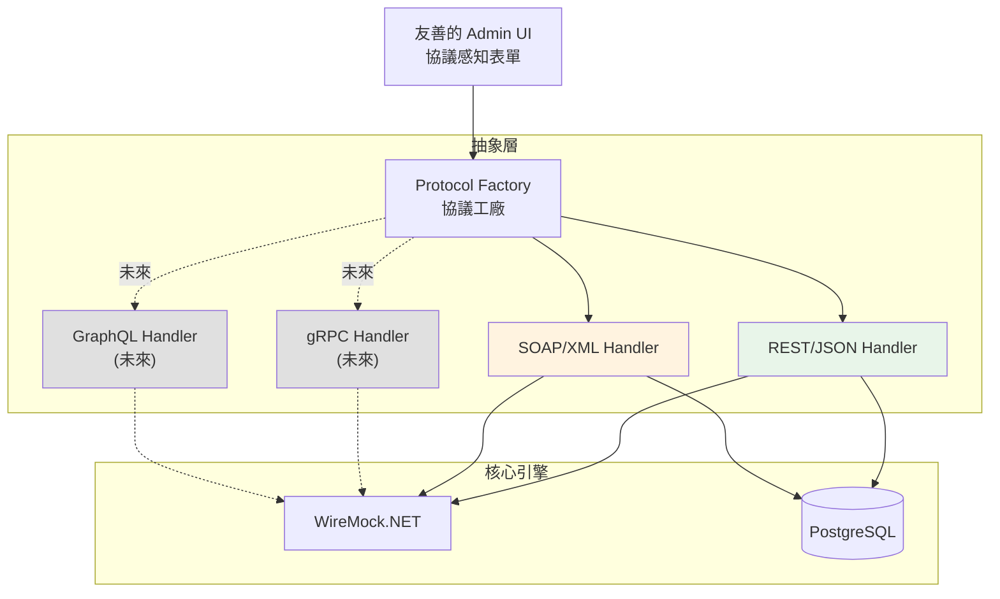

# 可擴展的協議架構設計
## 支援 REST/JSON、SOAP/XML，預留 gRPC、GraphQL

---

## 設計原則：**協議無關的抽象層**



---

## 1. 資料模型設計（協議無關）

### 核心 Entity

```csharp
// MockEndpoint.cs
public class MockEndpoint
{
    public Guid Id { get; set; }
    public string Name { get; set; }
    public string ServiceName { get; set; }

    // ⭐ 協議類型（擴展點）
    public ProtocolType Protocol { get; set; }  // REST, SOAP, gRPC, GraphQL

    // REST/SOAP 共用
    public string Path { get; set; }
    public string HttpMethod { get; set; }      // POST, GET... (REST/SOAP 都用)

    // 協議特定設定（JSON 儲存，彈性擴展）
    public string? ProtocolSettings { get; set; }  // 序列化的 JSON

    // Default Response
    public string? DefaultResponse { get; set; }
    public int? DefaultStatusCode { get; set; }

    public bool IsActive { get; set; }
    public List<MockRule> Rules { get; set; }
}

// ProtocolType.cs
public enum ProtocolType
{
    REST = 1,
    SOAP = 2,
    gRPC = 3,      // 未來
    GraphQL = 4    // 未來
}

// MockRule.cs
public class MockRule
{
    public Guid Id { get; set; }
    public Guid EndpointId { get; set; }
    public string RuleName { get; set; }
    public int Priority { get; set; }

    // ⭐ 條件（協議無關的抽象）
    public List<MatchCondition> Conditions { get; set; }

    // Response
    public int StatusCode { get; set; }
    public string ResponseBody { get; set; }
    public Dictionary<string, string>? Headers { get; set; }
    public int DelayMs { get; set; }
    public bool IsActive { get; set; }
}

// MatchCondition.cs - 抽象的條件定義
public class MatchCondition
{
    // ⭐ 欄位來源類型（擴展點）
    public FieldSourceType SourceType { get; set; }  // Body, Header, Query, Metadata

    // 欄位路徑（根據協議不同而不同）
    public string FieldPath { get; set; }
    // - REST: JsonPath ($.userId)
    // - SOAP: XPath (/soap:Envelope/soap:Body/ns:userId)
    // - gRPC: Field path (request.user_id)
    // - GraphQL: Field path (query.user.id)

    public MatchOperator Operator { get; set; }
    public string Value { get; set; }
}

// FieldSourceType.cs
public enum FieldSourceType
{
    Body = 1,       // REST body, SOAP body, gRPC message
    Header = 2,     // HTTP header, gRPC metadata
    Query = 3,      // REST query params
    Path = 4,       // REST path params
    Metadata = 5    // gRPC metadata, GraphQL context
}
```

---

## 2. 協議處理器架構（策略模式）

### Interface 定義

```csharp
// IProtocolHandler.cs
public interface IProtocolHandler
{
    ProtocolType SupportedProtocol { get; }

    // 驗證 Endpoint 設定
    ValidationResult ValidateEndpoint(MockEndpoint endpoint);

    // 驗證 Rule 條件
    ValidationResult ValidateConditions(List<MatchCondition> conditions);

    // 轉換為 WireMock 規則
    MappingModel ToWireMockMapping(MockRule rule, MockEndpoint endpoint);

    // 提供 UI Schema（告訴前端怎麼顯示表單）
    ProtocolSchema GetUISchema();
}

// ProtocolSchema.cs - 前端動態表單 schema
public class ProtocolSchema
{
    public ProtocolType Protocol { get; set; }
    public string DisplayName { get; set; }

    // 支援的欄位來源
    public List<FieldSourceOption> SupportedSources { get; set; }

    // 支援的運算子
    public List<OperatorOption> SupportedOperators { get; set; }

    // 特殊設定欄位
    public List<FormField> SettingsFields { get; set; }

    // 範例
    public List<Example> Examples { get; set; }
}
```

### REST Handler 實作

```csharp
// RestProtocolHandler.cs
public class RestProtocolHandler : IProtocolHandler
{
    public ProtocolType SupportedProtocol => ProtocolType.REST;

    public ValidationResult ValidateEndpoint(MockEndpoint endpoint)
    {
        // 驗證 REST 特定規則
        if (string.IsNullOrEmpty(endpoint.Path))
            return ValidationResult.Fail("Path is required");

        if (!endpoint.Path.StartsWith("/"))
            return ValidationResult.Fail("Path must start with /");

        return ValidationResult.Success();
    }

    public MappingModel ToWireMockMapping(MockRule rule, MockEndpoint endpoint)
    {
        var mapping = new MappingModel
        {
            Request = new RequestModel
            {
                Path = new PathModel {
                    Matchers = new[] {
                        new MatcherModel { Pattern = endpoint.Path }
                    }
                },
                Methods = new[] { endpoint.HttpMethod }
            },
            Response = new ResponseModel
            {
                StatusCode = rule.StatusCode,
                Body = rule.ResponseBody,
                Delay = rule.DelayMs
            }
        };

        // 處理條件
        foreach (var condition in rule.Conditions)
        {
            switch (condition.SourceType)
            {
                case FieldSourceType.Body:
                    // JsonPath matcher
                    mapping.Request.Body = new BodyModel
                    {
                        Matcher = new JsonPathMatcher
                        {
                            Pattern = condition.FieldPath,
                            // 根據 operator 設定...
                        }
                    };
                    break;

                case FieldSourceType.Header:
                    // Header matcher
                    var headerName = condition.FieldPath.Replace("header.", "");
                    mapping.Request.Headers[headerName] = CreateMatcher(condition);
                    break;

                case FieldSourceType.Query:
                    // Query matcher
                    var queryName = condition.FieldPath.Replace("query.", "");
                    mapping.Request.Params[queryName] = CreateMatcher(condition);
                    break;
            }
        }

        return mapping;
    }

    public ProtocolSchema GetUISchema()
    {
        return new ProtocolSchema
        {
            Protocol = ProtocolType.REST,
            DisplayName = "REST/JSON",
            SupportedSources = new List<FieldSourceOption>
            {
                new("body", "Request Body", "JsonPath (e.g., $.userId)"),
                new("header", "Header", "Header name"),
                new("query", "Query Parameter", "Param name")
            },
            SupportedOperators = new List<OperatorOption>
            {
                new("equals", "等於"),
                new("contains", "包含"),
                new("regex", "正則表達式")
            },
            Examples = new List<Example>
            {
                new("Body 匹配", "$.idn", "equals", "A123456789"),
                new("Header 匹配", "Authorization", "startsWith", "Bearer ")
            }
        };
    }
}
```

### SOAP Handler 實作

```csharp
// SoapProtocolHandler.cs
public class SoapProtocolHandler : IProtocolHandler
{
    public ProtocolType SupportedProtocol => ProtocolType.SOAP;

    public ValidationResult ValidateEndpoint(MockEndpoint endpoint)
    {
        // SOAP 通常是固定的 POST 端點
        if (endpoint.HttpMethod != "POST")
            return ValidationResult.Fail("SOAP must use POST method");

        return ValidationResult.Success();
    }

    public MappingModel ToWireMockMapping(MockRule rule, MockEndpoint endpoint)
    {
        var mapping = new MappingModel
        {
            Request = new RequestModel
            {
                Path = new PathModel {
                    Matchers = new[] {
                        new MatcherModel { Pattern = endpoint.Path }
                    }
                },
                Methods = new[] { "POST" },

                // SOAP 特定的 Content-Type 檢查
                Headers = new Dictionary<string, HeaderMatcher>
                {
                    ["Content-Type"] = new HeaderMatcher
                    {
                        Matchers = new[] {
                            new MatcherModel {
                                Pattern = "text/xml",
                                Name = "ContainsMatcher"
                            }
                        }
                    }
                }
            },
            Response = new ResponseModel
            {
                StatusCode = rule.StatusCode,
                Body = rule.ResponseBody,
                Headers = new Dictionary<string, string>
                {
                    ["Content-Type"] = "text/xml; charset=utf-8"
                },
                Delay = rule.DelayMs
            }
        };

        // 處理 SOAP 條件（使用 XPath）
        foreach (var condition in rule.Conditions)
        {
            if (condition.SourceType == FieldSourceType.Body)
            {
                // XPath matcher
                // 處理命名空間：使用 local-name() 避免命名空間問題
                var xpath = ConvertToNamespaceAgnosticXPath(condition.FieldPath);

                mapping.Request.Body = new BodyModel
                {
                    Matcher = new XPathMatcher
                    {
                        Pattern = xpath
                    }
                };
            }
        }

        return mapping;
    }

    private string ConvertToNamespaceAgnosticXPath(string xpath)
    {
        // 轉換為 local-name() 格式以避免命名空間問題
        // /soap:Envelope/soap:Body/ns:userId
        // → //*[local-name()='Envelope']/*[local-name()='Body']/*[local-name()='userId']

        // 實作邏輯...
        return xpath;
    }

    public ProtocolSchema GetUISchema()
    {
        return new ProtocolSchema
        {
            Protocol = ProtocolType.SOAP,
            DisplayName = "SOAP/XML",
            SupportedSources = new List<FieldSourceOption>
            {
                new("body", "SOAP Body", "XPath (e.g., //userId)"),
                new("header", "SOAP Header", "XPath in SOAP Header")
            },
            SupportedOperators = new List<OperatorOption>
            {
                new("equals", "等於"),
                new("contains", "包含"),
                new("exists", "存在")
            },
            Examples = new List<Example>
            {
                new("簡單匹配", "//userId", "equals", "12345"),
                new("命名空間匹配", "//*[local-name()='userId']", "equals", "12345")
            }
        };
    }
}
```

### 未來擴展：gRPC Handler（預留）

```csharp
// GrpcProtocolHandler.cs (未來實作)
public class GrpcProtocolHandler : IProtocolHandler
{
    public ProtocolType SupportedProtocol => ProtocolType.gRPC;

    public ValidationResult ValidateEndpoint(MockEndpoint endpoint)
    {
        // gRPC 特定驗證
        // - 需要 .proto 定義
        // - Service name + Method name
        throw new NotImplementedException("gRPC support coming soon");
    }

    public MappingModel ToWireMockMapping(MockRule rule, MockEndpoint endpoint)
    {
        // gRPC → HTTP/2 轉換邏輯
        // WireMock.NET 可能需要擴展或使用 gRPC-Web
        throw new NotImplementedException();
    }

    public ProtocolSchema GetUISchema()
    {
        return new ProtocolSchema
        {
            Protocol = ProtocolType.gRPC,
            DisplayName = "gRPC",
            SupportedSources = new List<FieldSourceOption>
            {
                new("message", "Message Field", "Field path (e.g., request.user_id)"),
                new("metadata", "Metadata", "Metadata key")
            }
        };
    }
}
```

---

## 3. Protocol Factory（工廠模式）

```csharp
// ProtocolHandlerFactory.cs
public class ProtocolHandlerFactory
{
    private readonly Dictionary<ProtocolType, IProtocolHandler> _handlers;

    public ProtocolHandlerFactory(IEnumerable<IProtocolHandler> handlers)
    {
        _handlers = handlers.ToDictionary(h => h.SupportedProtocol);
    }

    public IProtocolHandler GetHandler(ProtocolType protocol)
    {
        if (_handlers.TryGetValue(protocol, out var handler))
            return handler;

        throw new NotSupportedException($"Protocol {protocol} is not supported");
    }

    public List<ProtocolSchema> GetAllSchemas()
    {
        return _handlers.Values
            .Select(h => h.GetUISchema())
            .ToList();
    }
}

// DI 註冊
services.AddSingleton<IProtocolHandler, RestProtocolHandler>();
services.AddSingleton<IProtocolHandler, SoapProtocolHandler>();
// 未來新增：
// services.AddSingleton<IProtocolHandler, GrpcProtocolHandler>();
// services.AddSingleton<IProtocolHandler, GraphQLProtocolHandler>();

services.AddSingleton<ProtocolHandlerFactory>();
```

---

## 4. Admin API 設計（協議感知）

```csharp
// AdminEndpointsController.cs
[ApiController]
[Route("api/admin/endpoints")]
public class AdminEndpointsController : ControllerBase
{
    private readonly ProtocolHandlerFactory _factory;

    // 取得支援的協議列表
    [HttpGet("protocols")]
    public ActionResult<List<ProtocolSchema>> GetSupportedProtocols()
    {
        return _factory.GetAllSchemas();
    }

    // 建立 Endpoint（協議感知）
    [HttpPost]
    public async Task<ActionResult<MockEndpoint>> CreateEndpoint(
        [FromBody] CreateEndpointRequest request)
    {
        var handler = _factory.GetHandler(request.Protocol);

        // 驗證
        var validation = handler.ValidateEndpoint(request.ToEntity());
        if (!validation.IsValid)
            return BadRequest(validation.Errors);

        // 儲存到 DB
        var endpoint = await _repository.CreateAsync(request.ToEntity());

        // 同步到 WireMock（透過 handler）
        await SyncToWireMock(endpoint);

        return Ok(endpoint);
    }
}
```

---

## 5. 前端 UI 設計（協議切換）

### 動態表單元件

```tsx
// EndpointForm.tsx
function EndpointForm() {
  const [protocol, setProtocol] = useState<ProtocolType>('REST');
  const { data: schemas } = useProtocolSchemas(); // 從 API 取得

  const currentSchema = schemas?.find(s => s.protocol === protocol);

  return (
    <Form>
      {/* 協議選擇 */}
      <Select
        label="協議類型"
        value={protocol}
        onChange={setProtocol}
        options={schemas?.map(s => ({
          value: s.protocol,
          label: s.displayName
        }))}
      />

      {/* 基本資訊 */}
      <Input label="端點名稱" />
      <Input label="服務名稱" />
      <Input label="路徑" placeholder={getPathPlaceholder(protocol)} />

      {protocol === 'REST' && (
        <Select label="HTTP 方法" options={['GET', 'POST', 'PUT', 'DELETE']} />
      )}

      {protocol === 'SOAP' && (
        <Input label="SOAP Action" />
      )}

      {/* 規則編輯 */}
      <RuleEditor protocol={protocol} schema={currentSchema} />
    </Form>
  );
}

// RuleEditor.tsx - 協議感知的規則編輯器
function RuleEditor({ protocol, schema }: RuleEditorProps) {
  return (
    <div>
      <h3>匹配條件</h3>
      <ConditionBuilder
        supportedSources={schema.supportedSources}
        supportedOperators={schema.supportedOperators}
        examples={schema.examples}
      />

      {/* Response 編輯器（根據協議切換） */}
      {protocol === 'REST' && <JsonResponseEditor />}
      {protocol === 'SOAP' && <XmlResponseEditor />}
    </div>
  );
}

// ConditionBuilder.tsx - 動態條件建構器
function ConditionBuilder({
  supportedSources,
  supportedOperators,
  examples
}: ConditionBuilderProps) {
  return (
    <div>
      {conditions.map((condition, idx) => (
        <ConditionRow key={idx}>
          <Select
            label="欄位來源"
            options={supportedSources.map(s => ({
              value: s.value,
              label: s.label,
              hint: s.hint
            }))}
          />

          <Input
            label="欄位路徑"
            placeholder={getPlaceholder(condition.source)}
          />

          <Select
            label="運算子"
            options={supportedOperators}
          />

          <Input label="值" />
        </ConditionRow>
      ))}

      {/* 顯示範例 */}
      <ExampleHints examples={examples} />
    </div>
  );
}
```

### UI 架構

```
components/
├── protocol/                         # 協議相關
│   ├── ProtocolSelector.tsx
│   ├── ConditionBuilder.tsx          # 協議無關的條件建構器
│   └── editors/
│       ├── JsonResponseEditor.tsx    # REST
│       ├── XmlResponseEditor.tsx     # SOAP
│       ├── GrpcResponseEditor.tsx    # 未來
│       └── GraphQLResponseEditor.tsx # 未來
│
├── forms/
│   ├── EndpointForm.tsx              # 動態表單
│   └── RuleForm.tsx
│
└── common/
    ├── CodeEditor.tsx                # 通用編輯器
    └── SchemaForm.tsx                # 動態 schema-based 表單
```

---

## 6. 擴展新協議的步驟（未來）

### 新增 gRPC 支援（範例）

**Step 1: 實作 Handler**
```csharp
// GrpcProtocolHandler.cs
public class GrpcProtocolHandler : IProtocolHandler
{
    // 實作介面方法...
}
```

**Step 2: 註冊到 DI**
```csharp
services.AddSingleton<IProtocolHandler, GrpcProtocolHandler>();
```

**Step 3: 新增前端編輯器（可選）**
```tsx
// GrpcResponseEditor.tsx
function GrpcResponseEditor() {
  // Proto message 編輯器
}
```

**完成！UI 會自動顯示新協議選項**

---

## 7. 資料庫遷移策略

### Schema 版本化

```sql
-- V1: 基本支援 REST
CREATE TABLE mock_endpoints (
    protocol_type INT NOT NULL DEFAULT 1, -- REST
    ...
);

-- V2: 加入 SOAP 支援（無需改 schema）
-- 只需新增 handler

-- V3: 加入 gRPC 支援（可能需要新欄位）
ALTER TABLE mock_endpoints
ADD COLUMN protocol_settings JSONB;  -- 彈性儲存協議特定設定
```

---

## 8. 測試策略

```csharp
// ProtocolHandlerTests.cs
public class RestProtocolHandlerTests
{
    [Fact]
    public void Should_Convert_JsonPath_Condition_To_WireMock()
    {
        var handler = new RestProtocolHandler();
        var rule = CreateSampleRule();

        var mapping = handler.ToWireMockMapping(rule, endpoint);

        Assert.NotNull(mapping.Request.Body);
        Assert.IsType<JsonPathMatcher>(mapping.Request.Body.Matcher);
    }
}

public class SoapProtocolHandlerTests
{
    [Fact]
    public void Should_Convert_XPath_Condition_To_WireMock()
    {
        var handler = new SoapProtocolHandler();
        var rule = CreateSoapRule();

        var mapping = handler.ToWireMockMapping(rule, endpoint);

        Assert.IsType<XPathMatcher>(mapping.Request.Body.Matcher);
    }
}
```

---

## 總結

### ✅ 現在支援
- REST/JSON (JsonPath)
- SOAP/XML (XPath)

### 🔮 未來擴展（架構已準備好）
- gRPC (Protobuf)
- GraphQL (GraphQL query)

### 🎯 易於擴展的關鍵
1. **協議無關的資料模型** - `MatchCondition` 抽象化
2. **策略模式** - `IProtocolHandler` 介面
3. **工廠模式** - `ProtocolHandlerFactory` 動態註冊
4. **動態 UI** - 根據 `ProtocolSchema` 生成表單
5. **JSON 欄位** - `ProtocolSettings` 儲存特殊設定

**新增協議只需 3 步：實作 Handler → 註冊 DI → 完成！**
