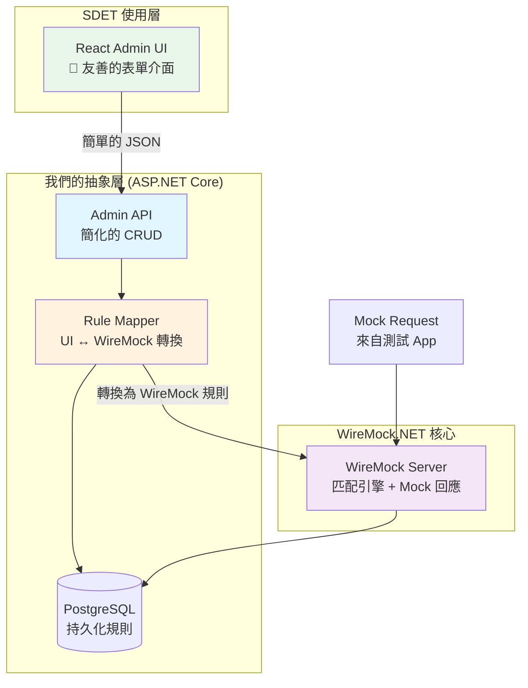

# Mock Server 整合架構設計
## 基於 WireMock.NET + 自建友善 UI

---

## 核心理念：**隱藏複雜性，暴露簡單性**

```
SDET 看到的：簡單的 UI 表單
     ↓
我們的抽象層：將 UI 輸入轉換為 WireMock 規則
     ↓
WireMock.NET：處理複雜的匹配與回應邏輯
```

---

## 整體架構



---

## 易用性設計重點

### 1. UI 簡化設計

#### ❌ 不要讓 SDET 看到這些複雜的東西：
```json
{
  "Request": {
    "Path": {
      "Matchers": [
        {
          "Name": "WildcardMatcher",
          "Pattern": "/api/*/users",
          "IgnoreCase": true
        }
      ]
    },
    "Body": {
      "Matcher": {
        "Name": "JsonPathMatcher",
        "Pattern": "$.idn"
      }
    }
  }
}
```

#### ✅ 讓 SDET 看到這樣的表單：
```
┌─────────────────────────────────────┐
│ 📝 新增 Mock 規則                    │
├─────────────────────────────────────┤
│                                     │
│ 端點路徑: /api/v1/credit/query      │
│ HTTP 方法: [POST ▼]                 │
│                                     │
│ ── 匹配條件 ──                      │
│ 欄位路徑         運算子      值      │
│ $.idn          [等於 ▼]   A123456  │
│ [+ 新增條件]                         │
│                                     │
│ ── 回應設定 ──                      │
│ 狀態碼: 200                         │
│ 延遲: 0 ms                          │
│                                     │
│ Response Body:                      │
│ ┌─────────────────────────────────┐│
│ │ {                               ││
│ │   "status": "success",          ││
│ │   "userId": "{{request.idn}}"   ││
│ │ }                               ││
│ └─────────────────────────────────┘│
│                                     │
│        [取消]  [儲存規則]            │
└─────────────────────────────────────┘
```

---

### 2. 資料模型設計（保持簡單）

#### 我們的 DB Schema（SDET 友善版）

```csharp
// MockEndpoint.cs
public class MockEndpoint
{
    public Guid Id { get; set; }
    public string Name { get; set; }              // "客戶信用查詢"
    public string ServiceName { get; set; }       // "聯徵中心"
    public string Path { get; set; }              // "/api/v1/credit/query"
    public string HttpMethod { get; set; }        // "POST"
    public string? DefaultResponse { get; set; }  // 預設回應 (未命中時)
    public int? DefaultStatusCode { get; set; }   // 預設狀態碼
    public bool IsActive { get; set; }

    public List<MockRule> Rules { get; set; }
}

// MockRule.cs
public class MockRule
{
    public Guid Id { get; set; }
    public Guid EndpointId { get; set; }
    public string RuleName { get; set; }          // "正常戶"、"凍結戶"
    public int Priority { get; set; }

    // 簡化的條件格式
    public List<SimpleCondition> Conditions { get; set; }

    // 簡化的回應格式
    public int StatusCode { get; set; }
    public string ResponseBody { get; set; }
    public Dictionary<string, string>? Headers { get; set; }
    public int DelayMs { get; set; }
    public bool IsActive { get; set; }
}

// SimpleCondition.cs - SDET 容易理解
public class SimpleCondition
{
    public string Field { get; set; }        // "$.idn" 或 "header.Authorization"
    public string Operator { get; set; }     // "equals", "contains", "startsWith"
    public string Value { get; set; }        // "A123456789"
}
```

---

### 3. Mapper 層（轉換邏輯）

```csharp
// WireMockRuleMapper.cs
public class WireMockRuleMapper
{
    // 將我們簡單的規則轉換為 WireMock 格式
    public MappingModel ToWireMockMapping(MockRule rule, MockEndpoint endpoint)
    {
        var mapping = new MappingModel
        {
            Guid = rule.Id,
            Priority = rule.Priority,

            Request = new RequestModel
            {
                Path = new PathModel { Matchers = new[] {
                    new MatcherModel {
                        Name = "WildcardMatcher",
                        Pattern = endpoint.Path
                    }
                }},
                Methods = new[] { endpoint.HttpMethod }
            },

            Response = new ResponseModel
            {
                StatusCode = rule.StatusCode,
                Body = rule.ResponseBody,
                Headers = rule.Headers,
                Delay = rule.DelayMs
            }
        };

        // 轉換我們的簡單條件為 WireMock 條件
        foreach (var condition in rule.Conditions)
        {
            AddConditionToMapping(mapping, condition);
        }

        return mapping;
    }

    private void AddConditionToMapping(MappingModel mapping, SimpleCondition condition)
    {
        if (condition.Field.StartsWith("$."))
        {
            // Body JsonPath 匹配
            mapping.Request.Body = new BodyModel
            {
                Matcher = new JsonPathMatcher
                {
                    Pattern = condition.Field,
                    // 根據 operator 設定 matcher
                }
            };
        }
        else if (condition.Field.StartsWith("header."))
        {
            // Header 匹配
            var headerName = condition.Field.Replace("header.", "");
            mapping.Request.Headers.Add(headerName, new HeaderMatcher
            {
                Matchers = GetMatcher(condition.Operator, condition.Value)
            });
        }
        else if (condition.Field.StartsWith("query."))
        {
            // Query 匹配
            var queryName = condition.Field.Replace("query.", "");
            mapping.Request.Params.Add(queryName, new ParamMatcher
            {
                Matchers = GetMatcher(condition.Operator, condition.Value)
            });
        }
    }
}
```

---

### 4. Admin API 設計（RESTful + 直觀）

```csharp
// Endpoints CRUD
GET    /api/admin/endpoints
GET    /api/admin/endpoints/{id}
POST   /api/admin/endpoints
PUT    /api/admin/endpoints/{id}
DELETE /api/admin/endpoints/{id}

// Rules CRUD
GET    /api/admin/endpoints/{endpointId}/rules
GET    /api/admin/endpoints/{endpointId}/rules/{ruleId}
POST   /api/admin/endpoints/{endpointId}/rules
PUT    /api/admin/endpoints/{endpointId}/rules/{ruleId}
DELETE /api/admin/endpoints/{endpointId}/rules/{ruleId}

// 便利功能
PUT    /api/admin/endpoints/{endpointId}/rules/reorder    // 批次調整優先序
POST   /api/admin/endpoints/{endpointId}/rules/{ruleId}/duplicate  // 複製規則
POST   /api/admin/test                                    // 快速測試

// Default Response 設定
PUT    /api/admin/endpoints/{endpointId}/default-response

// 規則啟用/停用
POST   /api/admin/endpoints/{endpointId}/toggle          // 快速切換
POST   /api/admin/rules/{ruleId}/toggle
```

---

### 5. 前端 UI 規劃（Playbook 設計系統）

#### 使用設計系統：

**推薦選項：**

1. **Ant Design** (推薦 ⭐⭐⭐⭐⭐)
   - 企業級設計規範
   - 豐富的 Form 元件
   - 內建 JSON Editor
   - 中文支援完善

2. **Material-UI (MUI)**
   - Google Material Design
   - 元件完整

3. **Chakra UI**
   - 輕量、現代化
   - 易於客製化

#### UI 組件模組化結構：

```
frontend/
├── src/
│   ├── components/
│   │   ├── common/                    # 通用元件
│   │   │   ├── Button/
│   │   │   ├── Card/
│   │   │   ├── Table/
│   │   │   └── Modal/
│   │   │
│   │   ├── forms/                     # 表單元件
│   │   │   ├── EndpointForm/
│   │   │   ├── RuleForm/
│   │   │   ├── ConditionBuilder/     # 條件建構器（核心）
│   │   │   ├── JsonEditor/           # JSON 編輯器
│   │   │   └── ResponseEditor/       # Response 編輯器
│   │   │
│   │   ├── displays/                  # 展示元件
│   │   │   ├── EndpointCard/
│   │   │   ├── RuleCard/
│   │   │   ├── LogViewer/
│   │   │   └── StatsCard/
│   │   │
│   │   └── layout/                    # 佈局元件
│   │       ├── Sidebar/
│   │       ├── Header/
│   │       └── PageContainer/
│   │
│   ├── pages/
│   │   ├── Dashboard/                 # 儀表板
│   │   ├── Endpoints/
│   │   │   ├── List/
│   │   │   ├── Detail/
│   │   │   └── Create/
│   │   ├── Rules/
│   │   │   ├── List/
│   │   │   └── Editor/
│   │   └── Logs/
│   │
│   ├── services/
│   │   ├── api.ts                     # Axios instance
│   │   ├── endpoints.service.ts
│   │   ├── rules.service.ts
│   │   └── logs.service.ts
│   │
│   ├── hooks/                         # Custom hooks
│   │   ├── useEndpoints.ts
│   │   ├── useRules.ts
│   │   └── useTest.ts
│   │
│   ├── types/                         # TypeScript 型別
│   │   ├── endpoint.ts
│   │   ├── rule.ts
│   │   └── condition.ts
│   │
│   └── theme/                         # 設計系統
│       ├── colors.ts
│       ├── typography.ts
│       └── components.ts
```

---

### 6. 核心 UI 元件設計

#### ConditionBuilder（條件建構器）- 最重要的元件

```tsx
// ConditionBuilder.tsx
interface Condition {
  field: string;      // $.idn, header.Authorization, query.status
  operator: string;   // equals, contains, startsWith...
  value: string;
}

function ConditionBuilder({
  conditions,
  onChange
}: ConditionBuilderProps) {
  return (
    <div className="condition-builder">
      <h3>匹配條件</h3>
      {conditions.map((condition, index) => (
        <ConditionRow
          key={index}
          condition={condition}
          onUpdate={(updated) => updateCondition(index, updated)}
          onRemove={() => removeCondition(index)}
        />
      ))}
      <Button onClick={addCondition}>+ 新增條件</Button>
    </div>
  );
}

// ConditionRow 設計
<div className="condition-row">
  <Select
    label="欄位類型"
    options={[
      { value: 'body', label: 'Request Body' },
      { value: 'header', label: 'Header' },
      { value: 'query', label: 'Query Parameter' }
    ]}
  />

  <Input
    label="欄位路徑"
    placeholder="$.idn 或 Authorization"
  />

  <Select
    label="運算子"
    options={[
      { value: 'equals', label: '等於' },
      { value: 'contains', label: '包含' },
      { value: 'startsWith', label: '開頭是' },
      { value: 'regex', label: '正則表達式' }
    ]}
  />

  <Input
    label="值"
    placeholder="匹配的值"
  />

  <IconButton onClick={onRemove}>🗑️</IconButton>
</div>
```

---

### 7. 快速測試面板（即時驗證）

```tsx
// TestPanel.tsx - 嵌在規則編輯頁
function TestPanel({ endpointId }: TestPanelProps) {
  return (
    <Card title="🧪 快速測試">
      <JsonEditor
        label="Request Body"
        value={testRequest}
        onChange={setTestRequest}
      />

      <Button onClick={runTest}>執行測試</Button>

      {testResult && (
        <Result>
          <Badge>命中規則: {testResult.matchedRule}</Badge>
          <StatusCode>{testResult.statusCode}</StatusCode>
          <JsonViewer value={testResult.response} />
        </Result>
      )}
    </Card>
  );
}
```

---

### 8. 簡化的操作流程

#### SDET 建立 Mock 的步驟：

```
1. 點選「新增 Endpoint」
   ↓ 填寫：名稱、路徑、HTTP 方法
   ↓
2. 點選「新增規則」
   ↓ 填寫：規則名稱
   ↓ 新增條件（欄位、運算子、值）
   ↓ 填寫 Response（狀態碼、Body）
   ↓
3. 點選「快速測試」
   ↓ 輸入測試 Request
   ↓ 看到即時結果
   ↓
4. 點選「儲存」
   ✅ 完成！規則立即生效
```

**全程無需了解 WireMock.NET 或寫 JSON 配置！**

---

## 技術整合方案

### Project 結構

```
mServer/
├── backend/
│   ├── MockServer.Api/                    # 我們的 API 層
│   │   ├── Controllers/
│   │   │   └── AdminController.cs         # CRUD API
│   │   ├── Services/
│   │   │   ├── WireMockService.cs         # WireMock 包裝
│   │   │   └── RuleMapperService.cs       # 規則轉換
│   │   └── Program.cs
│   │
│   ├── MockServer.Core/                   # Domain 層
│   │   ├── Entities/                      # 簡化的 Entity
│   │   └── Interfaces/
│   │
│   └── MockServer.Infrastructure/
│       ├── Data/                          # EF Core + PostgreSQL
│       └── WireMock/
│           ├── WireMockRuleMapper.cs      # 核心轉換邏輯
│           └── WireMockServerManager.cs   # WireMock 管理
│
├── frontend/
│   ├── src/
│   │   ├── components/
│   │   ├── pages/
│   │   └── services/
│   └── package.json
│
└── docker-compose.yml
```

### NuGet Packages

```xml
<PackageReference Include="WireMock.Net" Version="1.6.*" />
<PackageReference Include="Npgsql.EntityFrameworkCore.PostgreSQL" Version="8.0.*" />
<PackageReference Include="Newtonsoft.Json" Version="13.0.*" />
```

---

## 易用性檢查清單

✅ **SDET 不需要知道：**
- WireMock.NET 的 JSON 格式
- JsonPath 複雜語法（提供欄位選擇器）
- Matcher 類型細節
- HTTP 協議細節

✅ **SDET 只需要知道：**
- 我要 mock 哪個 API 路徑
- 當 request 的某個欄位等於某個值時
- 回傳什麼 response

✅ **UI 要提供：**
- 預設值（狀態碼 200、空 header）
- 範例提示（顯示 JSON 範例）
- 即時驗證（測試按鈕）
- 錯誤提示（清楚的錯誤訊息）
- 快速操作（複製、停用、刪除）

---

## 下一步

1. ✅ **Phase 1：建立基礎架構**
   - 整合 WireMock.NET
   - 建立 Mapper 層
   - 實作 Admin API
   - PostgreSQL Schema

2. 🎨 **Phase 2：建立前端 Playbook**
   - 選擇設計系統（Ant Design 推薦）
   - 建立核心元件（ConditionBuilder）
   - 實作主要頁面

3. 🧪 **Phase 3：測試與優化**
   - SDET 實測
   - 收集反饋
   - 調整 UX

**要開始實作了嗎？**
