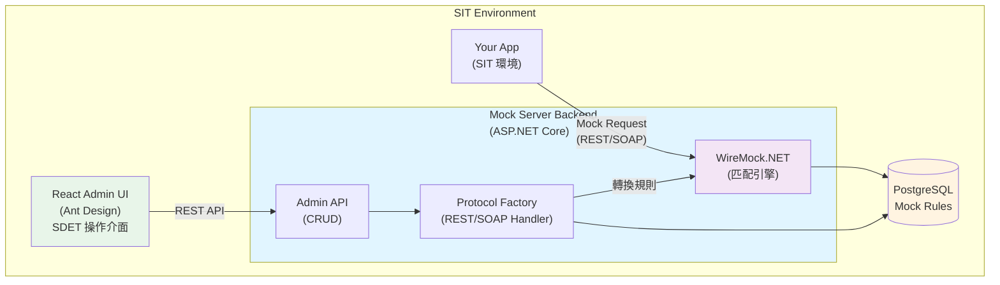
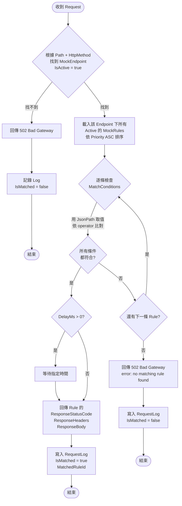

# Mock Server 系統設計文件

## 1. 專案目標

建立一個自帶管理 UI 的 Mock Server，讓 SDET 可以透過介面自行設定 API mock 規則，根據 request body 欄位（如證號）回傳不同 response。所有規則存在資料庫中，不需要改 code 或重啟服務。

## 2. 整體架構



## 3. 技術選型

| 項目 | 技術 |
|------|------|
| 後端 | ASP.NET Core 8 Minimal API |
| 資料庫 | PostgreSQL |
| ORM | EF Core with Npgsql |
| 前端 | React (Vite + TypeScript) + Ant Design |
| Mock 引擎 | WireMock.NET (1.6k stars) |
| 協議支援 | REST/JSON (JsonPath)、SOAP/XML (XPath) |
| 未來擴展 | gRPC、GraphQL (架構已預留) |
| 部署 | Docker Compose（前後端分離） |

## 4. DB Schema 設計

### 4.1 MockEndpoints（端點定義）

| 欄位 | 型別 | 說明 |
|------|------|------|
| Id | GUID (PK) | 主鍵 |
| Name | string | 顯示名稱，e.g. "查詢客戶資料" |
| ServiceName | string | 第三方服務名稱，e.g. "信用查詢系統" |
| ProtocolType | int | 協議類型：1=REST, 2=SOAP, 3=gRPC, 4=GraphQL |
| Path | string | 路徑，e.g. "/api/v1/credit/query" |
| HttpMethod | string | GET / POST / PUT / DELETE |
| DefaultResponse | string (nullable) | 預設回應內容（未命中規則時） |
| DefaultStatusCode | int (nullable) | 預設狀態碼（未命中規則時） |
| ProtocolSettings | string (JSON, nullable) | 協議特定設定（彈性擴展） |
| Description | string | 說明 |
| IsActive | bool | 啟用 / 停用 |
| CreatedAt | DateTime | 建立時間 |
| UpdatedAt | DateTime | 更新時間 |

### 4.2 MockRules（匹配規則 + Response）

| 欄位 | 型別 | 說明 |
|------|------|------|
| Id | GUID (PK) | 主鍵 |
| EndpointId | GUID (FK) | 關聯 MockEndpoints |
| RuleName | string | 規則名稱，e.g. "正常戶"、"凍結戶"、"查無此人" |
| Priority | int | 優先序，數字越小越優先 |
| MatchConditions | string (JSON) | 匹配條件，JSON 格式 |
| ResponseStatusCode | int | HTTP 回應碼，e.g. 200, 404, 500 |
| ResponseHeaders | string (JSON) | 回應 Headers，JSON 格式 |
| ResponseBody | string | 回應 Body，完整 JSON string |
| DelayMs | int | 模擬延遲毫秒數 |
| IsActive | bool | 啟用 / 停用 |
| CreatedAt | DateTime | 建立時間 |
| UpdatedAt | DateTime | 更新時間 |

#### MatchConditions JSON 格式範例

**REST/JSON 範例：**
```json
[
  { "sourceType": "body", "fieldPath": "$.idn", "operator": "equals", "value": "P220395911" },
  { "sourceType": "header", "fieldPath": "Authorization", "operator": "startsWith", "value": "Bearer " },
  { "sourceType": "query", "fieldPath": "status", "operator": "equals", "value": "active" }
]
```

**SOAP/XML 範例：**
```json
[
  { "sourceType": "body", "fieldPath": "//*[local-name()='userId']", "operator": "equals", "value": "12345" },
  { "sourceType": "body", "fieldPath": "//accountStatus", "operator": "contains", "value": "active" }
]
```

所有條件為 AND 關係，全部符合才算命中。

**SourceType 說明：**
- `body`: Request Body（REST: JsonPath, SOAP: XPath）
- `header`: HTTP Header
- `query`: Query Parameter (REST only)
- `path`: Path Parameter (REST only)
- `metadata`: gRPC metadata (未來)

### 4.3 MockRequestLogs（請求紀錄）

| 欄位 | 型別 | 說明 |
|------|------|------|
| Id | GUID (PK) | 主鍵 |
| EndpointId | GUID (FK, nullable) | 關聯 MockEndpoints |
| MatchedRuleId | GUID (FK, nullable) | 命中的規則，null 表示沒命中 |
| RequestPath | string | 請求路徑 |
| RequestHeaders | string (JSON) | 請求 Headers |
| RequestBody | string | 請求 Body |
| ResponseStatusCode | int | 回傳的狀態碼 |
| ResponseBody | string | 回傳的 Body |
| IsMatched | bool | 是否有命中規則 |
| Timestamp | DateTime | 請求時間 |
| DurationMs | long | 處理耗時（ms） |

## 5. 匹配邏輯流程



### 5.1 支援的 Operator

| Operator | 說明 | 範例 |
|----------|------|------|
| `equals` | 完全匹配 | `$.idn` equals `"P220395911"` |
| `notEquals` | 不等於 | `$.status` notEquals `"closed"` |
| `contains` | 包含字串 | `$.name` contains `"王"` |
| `startsWith` | 開頭匹配 | `$.idn` startsWith `"P"` |
| `endsWith` | 結尾匹配 | `$.email` endsWith `"@gmail.com"` |
| `regex` | 正則表達式 | `$.idn` regex `"^[A-Z]\d{9}$"` |
| `greaterThan` | 大於（數值） | `$.amount` greaterThan `1000` |
| `lessThan` | 小於（數值） | `$.age` lessThan `18` |
| `exists` | 欄位存在 | `$.token` exists |
| `notExists` | 欄位不存在 | `$.error` notExists |
| `any` | 任何值都匹配 | `$.idn` any（作為 fallback） |

## 6. API 設計

### 6.1 Mock 接口（給 SIT App 呼叫）

所有送到 Mock Server 的請求都會經過 Dynamic Router Middleware 處理，根據 Path + Method 匹配 DB 中的規則。

### 6.2 Admin API（給管理 UI 使用）

```
Protocols:
  GET    /admin/api/protocols              → 取得支援的協議列表及 Schema

Endpoints:
  GET    /admin/api/endpoints              → 列出所有端點
  GET    /admin/api/endpoints/{id}         → 取得單一端點
  POST   /admin/api/endpoints              → 新增端點（協議感知）
  PUT    /admin/api/endpoints/{id}         → 更新端點
  DELETE /admin/api/endpoints/{id}         → 刪除端點
  PUT    /admin/api/endpoints/{id}/default → 設定預設回應

Rules:
  GET    /admin/api/endpoints/{endpointId}/rules          → 列出該端點的所有規則
  GET    /admin/api/endpoints/{endpointId}/rules/{id}     → 取得單一規則
  POST   /admin/api/endpoints/{endpointId}/rules          → 新增規則
  PUT    /admin/api/endpoints/{endpointId}/rules/{id}     → 更新規則
  DELETE /admin/api/endpoints/{endpointId}/rules/{id}     → 刪除規則
  PUT    /admin/api/endpoints/{endpointId}/rules/priority → 批次更新優先序

Logs:
  GET    /admin/api/logs                   → 列出請求紀錄（支援分頁、篩選）
  GET    /admin/api/logs/{id}              → 取得單筆紀錄詳情
  DELETE /admin/api/logs                   → 清除紀錄

Import/Export:
  GET    /admin/api/export                 → 匯出全部規則為 JSON
  POST   /admin/api/import                 → 匯入 JSON 規則

Test:
  POST   /admin/api/test                   → 快速測試（送 request body，回傳匹配結果）
```

## 7. Admin UI 頁面規劃

### 7.1 Dashboard（總覽）

- 各 Service 狀態一覽（啟用中的 Endpoint 數量、Rule 數量）
- 最近 10 筆 Request Log
- 命中率統計（命中 / 未命中比例）

### 7.2 Endpoints 管理

- 列表頁：顯示 ServiceName / Path / Method / 狀態 / Rule 數量
- 新增/編輯表單：Name, ServiceName, Path, HttpMethod, Description, IsActive
- 支援停用/啟用切換
- 點進去可以管理該 Endpoint 的 Rules

### 7.3 Rules 管理（某個 Endpoint 底下）

- 規則列表，依 Priority 排列
- 新增/編輯規則表單：
  - Rule 名稱
  - Match Conditions（動態新增多筆條件）
    - JsonPath 欄位（e.g. `$.idn`）
    - Operator 下拉選單
    - 匹配值
  - Response Status Code
  - Response Headers（key-value 動態新增）
  - Response Body（JSON 編輯器，支援格式化）
  - Delay（ms）
  - IsActive
- 拖拉調整優先序
- 複製規則（快速建立類似的測試情境）
- 快速測試按鈕（輸入 request body，看會命中哪條規則）

### 7.4 Request Logs

- 即時 Log 列表
- 篩選條件：Endpoint / 命中與否 / 時間區間
- 點進去看完整 Request/Response 詳情
- 清除 Log 按鈕

### 7.5 Import / Export

- 匯出全部規則為 JSON 檔案
- 匯入 JSON 檔案（方便跨環境搬移規則）
- 匯入時選擇覆蓋或合併

## 8. Project 結構

```
mServer/
├── backend/
│   ├── MockServer.sln
│   ├── src/
│   │   ├── MockServer.Core/                    # Domain 層
│   │   │   ├── Entities/
│   │   │   │   ├── MockEndpoint.cs
│   │   │   │   ├── MockRule.cs
│   │   │   │   ├── MatchCondition.cs          # MatchConditions 的強型別
│   │   │   │   └── MockRequestLog.cs
│   │   │   ├── Enums/
│   │   │   │   ├── ProtocolType.cs            # REST, SOAP, gRPC, GraphQL
│   │   │   │   ├── FieldSourceType.cs         # Body, Header, Query, Path, Metadata
│   │   │   │   └── MatchOperator.cs           # equals, contains, regex...
│   │   │   └── Interfaces/
│   │   │       ├── IEndpointRepository.cs
│   │   │       ├── IRuleRepository.cs
│   │   │       ├── IRequestLogRepository.cs
│   │   │       └── IProtocolHandler.cs        # 協議處理器介面
│   │   │
│   │   ├── MockServer.Infrastructure/          # 基礎設施層
│   │   │   ├── Data/
│   │   │   │   ├── MockServerDbContext.cs
│   │   │   │   └── Migrations/
│   │   │   ├── Repositories/
│   │   │   │   ├── EndpointRepository.cs
│   │   │   │   ├── RuleRepository.cs
│   │   │   │   └── RequestLogRepository.cs
│   │   │   ├── WireMock/
│   │   │   │   ├── WireMockServerManager.cs    # WireMock 伺服器管理
│   │   │   │   └── WireMockRuleMapper.cs       # 規則轉換基礎類別
│   │   │   └── ProtocolHandlers/
│   │   │       ├── ProtocolHandlerFactory.cs   # 協議工廠
│   │   │       ├── RestProtocolHandler.cs      # REST/JSON 處理器
│   │   │       ├── SoapProtocolHandler.cs      # SOAP/XML 處理器
│   │   │       ├── GrpcProtocolHandler.cs      # gRPC 處理器（未來）
│   │   │       └── GraphQLProtocolHandler.cs   # GraphQL 處理器（未來）
│   │   │
│   │   └── MockServer.Api/                     # Mock API + Admin API
│   │       ├── Program.cs
│   │       ├── appsettings.json
│   │       ├── Middleware/
│   │       │   └── DynamicMockMiddleware.cs    # 核心：攔截請求、查 DB、回傳 mock
│   │       ├── Endpoints/
│   │       │   ├── AdminEndpointApis.cs        # Admin CRUD for Endpoints
│   │       │   ├── AdminRuleApis.cs            # Admin CRUD for Rules
│   │       │   ├── AdminLogApis.cs             # Admin Log APIs
│   │       │   └── AdminImportExportApis.cs    # Import/Export APIs
│   │       ├── DTOs/
│   │       │   ├── EndpointDto.cs
│   │       │   ├── RuleDto.cs
│   │       │   ├── LogDto.cs
│   │       │   └── TestRequestDto.cs
│   │       └── Dockerfile
│   │
│   └── tests/
│       └── MockServer.Tests/
│           ├── MatcherTests.cs                 # 匹配引擎單元測試
│           ├── OperatorEvaluatorTests.cs
│           └── IntegrationTests.cs
│
├── frontend/
│   ├── package.json
│   ├── vite.config.ts
│   ├── tsconfig.json
│   ├── src/
│   │   ├── main.tsx
│   │   ├── App.tsx
│   │   ├── pages/
│   │   │   ├── Dashboard.tsx               # 總覽頁
│   │   │   ├── Endpoints/
│   │   │   │   ├── EndpointList.tsx
│   │   │   │   └── EndpointForm.tsx
│   │   │   ├── Rules/
│   │   │   │   ├── RuleList.tsx
│   │   │   │   └── RuleForm.tsx
│   │   │   ├── Logs/
│   │   │   │   ├── LogList.tsx
│   │   │   │   └── LogDetail.tsx
│   │   │   └── ImportExport.tsx
│   │   ├── components/
│   │   │   ├── JsonEditor.tsx              # JSON 編輯器元件
│   │   │   ├── ConditionEditor.tsx         # Match Condition 動態編輯元件
│   │   │   └── TestPanel.tsx               # 快速測試面板
│   │   ├── services/
│   │   │   └── api.ts                      # API client (axios)
│   │   ├── types/
│   │   │   └── index.ts                    # TypeScript 型別定義
│   │   └── utils/
│   │       └── helpers.ts
│   └── Dockerfile
│
├── docker-compose.yml
└── README.md
```

## 9. 使用範例

### 情境：測試信用查詢 API，需要不同證號回不同結果

**Step 1: SDET 新增 Endpoint**

| 欄位 | 值 |
|------|---|
| Name | 信用查詢 |
| ServiceName | 聯徵中心 |
| Path | /api/v1/credit/query |
| HttpMethod | POST |

**Step 2: SDET 新增 Rules**

**Rule 1 - 正常戶（Priority: 1）**

Match Conditions:
```json
[{ "field": "$.idn", "operator": "equals", "value": "P220395911" }]
```

Response (200):
```json
{
  "resultCode": "0000",
  "name": "王小明",
  "status": "active",
  "creditScore": 750
}
```

**Rule 2 - 凍結戶（Priority: 2）**

Match Conditions:
```json
[{ "field": "$.idn", "operator": "equals", "value": "A123456789" }]
```

Response (200):
```json
{
  "resultCode": "0000",
  "name": "李大華",
  "status": "frozen",
  "creditScore": 0
}
```

**Rule 3 - 系統錯誤（Priority: 3）**

Match Conditions:
```json
[{ "field": "$.idn", "operator": "startsWith", "value": "X" }]
```

Response (500):
```json
{
  "resultCode": "9999",
  "error": "system error"
}
```

**Rule 4 - 預設回應（Priority: 99）**

Match Conditions:
```json
[]
```

Response (200):
```json
{
  "resultCode": "0000",
  "name": "預設使用者",
  "status": "active",
  "creditScore": 600
}
```

### 測試驗證

```bash
# 正常戶
curl -X POST http://mockserver:5000/api/v1/credit/query \
  -H "Content-Type: application/json" \
  -d '{"idn":"P220395911","accountId":123456}'
# → 200, creditScore: 750

# 凍結戶
curl -X POST http://mockserver:5000/api/v1/credit/query \
  -H "Content-Type: application/json" \
  -d '{"idn":"A123456789","accountId":789012}'
# → 200, status: frozen

# 系統錯誤
curl -X POST http://mockserver:5000/api/v1/credit/query \
  -H "Content-Type: application/json" \
  -d '{"idn":"X000000000","accountId":111111}'
# → 500, system error

# 預設
curl -X POST http://mockserver:5000/api/v1/credit/query \
  -H "Content-Type: application/json" \
  -d '{"idn":"B987654321","accountId":222222}'
# → 200, 預設使用者
```

## 10. Docker 部署

```yaml
# docker-compose.yml
version: '3.8'

services:
  postgres:
    image: postgres:16-alpine
    container_name: mockserver-db
    environment:
      POSTGRES_DB: mockserver
      POSTGRES_USER: mockserver
      POSTGRES_PASSWORD: mockserver123
    ports:
      - "5432:5432"
    volumes:
      - postgres-data:/var/lib/postgresql/data
    healthcheck:
      test: ["CMD-SHELL", "pg_isready -U mockserver"]
      interval: 5s
      timeout: 5s
      retries: 5

  backend:
    build:
      context: ./backend
      dockerfile: Dockerfile
    container_name: mockserver-backend
    ports:
      - "5000:8080"    # Mock API + Admin API
    environment:
      - ASPNETCORE_ENVIRONMENT=Development
      - ConnectionStrings__Default=Host=postgres;Database=mockserver;Username=mockserver;Password=mockserver123
      - ASPNETCORE_URLS=http://+:8080
    depends_on:
      postgres:
        condition: service_healthy
    restart: unless-stopped

  frontend:
    build:
      context: ./frontend
      dockerfile: Dockerfile
    container_name: mockserver-frontend
    ports:
      - "3000:80"      # Admin UI
    environment:
      - VITE_API_URL=http://localhost:5000
    depends_on:
      - backend
    restart: unless-stopped

volumes:
  postgres-data:
```

```dockerfile
# backend/Dockerfile
FROM mcr.microsoft.com/dotnet/aspnet:8.0 AS base
WORKDIR /app
EXPOSE 8080

FROM mcr.microsoft.com/dotnet/sdk:8.0 AS build
WORKDIR /src
COPY ["src/MockServer.Api/MockServer.Api.csproj", "MockServer.Api/"]
COPY ["src/MockServer.Core/MockServer.Core.csproj", "MockServer.Core/"]
COPY ["src/MockServer.Infrastructure/MockServer.Infrastructure.csproj", "MockServer.Infrastructure/"]
RUN dotnet restore "MockServer.Api/MockServer.Api.csproj"

COPY src/ .
WORKDIR "/src/MockServer.Api"
RUN dotnet build "MockServer.Api.csproj" -c Release -o /app/build

FROM build AS publish
RUN dotnet publish "MockServer.Api.csproj" -c Release -o /app/publish /p:UseAppHost=false

FROM base AS final
WORKDIR /app
COPY --from=publish /app/publish .
ENTRYPOINT ["dotnet", "MockServer.Api.dll"]
```

```dockerfile
# frontend/Dockerfile
FROM node:20-alpine AS build
WORKDIR /app

COPY package*.json ./
RUN npm ci

COPY . .
RUN npm run build

FROM nginx:alpine
COPY --from=build /app/dist /usr/share/nginx/html
COPY nginx.conf /etc/nginx/conf.d/default.conf
EXPOSE 80
CMD ["nginx", "-g", "daemon off;"]
```

## 11. 架構特色

### 已實現
✅ **多協議支援**：REST/JSON、SOAP/XML，架構可擴展至 gRPC、GraphQL
✅ **協議無關設計**：統一的資料模型，易於擴展新協議
✅ **WireMock.NET 整合**：利用成熟的匹配引擎
✅ **Default Response**：未命中規則時的預設回應
✅ **易用 UI**：隱藏複雜性，SDET 友善的表單介面

### 後續擴充方向

#### Phase 2 增強功能
- **Response Template**：支援 Handlebars 模板，可在 response 中引用 request 欄位（WireMock.NET 已支援）
- **Path Parameters**：動態路徑參數匹配（如 `/api/users/{id}`）
- **Scenario / State**：有狀態的 mock（第一次呼叫回 A，第二次回 B）

#### Phase 3 進階功能
- **Proxy Mode**：未命中規則時轉發到真實第三方（混合模式）
- **Recording Mode**：錄製真實 API 回應自動產生規則
- **權限控制**：不同 SDET 只能管理自己負責的 Service
- **Webhook / Callback**：mock 被呼叫後觸發通知

#### Phase 4 整合功能
- **gRPC 支援**：完整實作 gRPC 協議處理器
- **GraphQL 支援**：完整實作 GraphQL 協議處理器
- **API Spec Import**：匯入 OpenAPI / Swagger 自動產生 Endpoint 骨架
- **Contract Testing**：整合 Pact 驗證
